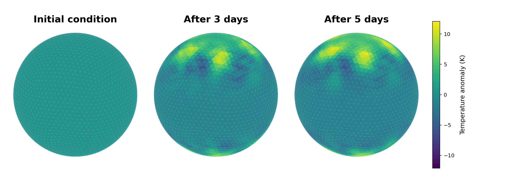

# ICON in Python Demo

[](https://github.com/ofuhrer/icon4py_demo/actions/workflows/test.yml)
[](https://www.python.org/downloads/release/python-3100/)
[](LICENSE)
[](https://nbviewer.org/github/ofuhrer/icon4py_demo/blob/main/icon4py_demo.ipynb)

This repository contains a small, inspectable Jupyter notebook that runs an
ICON4Py atmosphere experiment from Python. It generates an ICON grid in memory,
builds an analytical dry Jablonowski-Williamson initial condition, runs a short
time integration, and plots selected state fields and diagnostics.



The goal is to make the Python-facing workflow understandable: configuration,
grid creation, state initialization, model construction, timestepping, and
visualization are kept as explicit notebook steps.

## Notebook

- Open the notebook on GitHub: [icon4py_demo.ipynb](icon4py_demo.ipynb)
- View a rendered copy on nbviewer:
  [icon4py_demo.ipynb](https://nbviewer.org/github/ofuhrer/icon4py_demo/blob/main/icon4py_demo.ipynb)

The notebook includes selected outputs so the repository has a useful static
preview. For local experimentation, run it in JupyterLab as described below.

## Requirements

- Python 3.10
- A working C++ build toolchain for GT4Py/ICON4Py stencil compilation
- Network access during installation, because ICON4Py packages are installed
  from a pinned upstream Git commit

## Quickstart

From this repository:

```bash
make install
source .venv/bin/activate
```

Registering the kernel is optional, but it makes the environment easy to select
inside JupyterLab:

```bash
.venv/bin/python -m ipykernel install --user \
  --name icon4py-demo \
  --display-name "ICON4Py demo"
```

Start JupyterLab from this directory:

```bash
source .venv/bin/activate
export PATH="$PWD/.venv/bin:$PATH"
jupyter lab \
  --ip 127.0.0.1 \
  --port 8888 \
  --no-browser \
  --IdentityProvider.token='' \
  --PasswordIdentityProvider.hashed_password=''
```

Then open `http://127.0.0.1:8888/lab` and select the `ICON4Py demo` kernel.

## Validation

Run the lightweight checks used for development:

```bash
make lint
make test
```

The default pytest run skips expensive ICON4Py workflow checks. Run those
explicitly when changing model setup or timestepping behavior:

```bash
make test-slow
```

For a non-interactive notebook execution check:

```bash
make notebook-check
```

This keeps execution counts and generated outputs out of the tracked notebook.

The README figure is generated from the same helper workflow as the notebook:

```bash
make readme-figure
```

## Dependency Maintenance

`requirements.txt` is the installation entrypoint. It references
`constraints.txt`, which pins the non-ICON support packages used by the demo.
The ICON4Py packages are pinned to one upstream Git commit and should be updated
together so the namespace subpackages stay compatible.

When refreshing dependencies:

1. Update `constraints.txt` for ordinary Python packages.
2. Update every ICON4Py Git URL in `requirements.txt` to the same commit.
3. Recreate the environment with `make install`.
4. Run `make lint`, `make test`, and, when changing model setup behavior,
   `make test-slow` or `make notebook-check`.

## Notebook Hygiene

The tracked notebook is expected to remain valid JSON, free of error outputs,
and free of local machine paths. If you re-run cells locally, review the diff
before committing. Generated execution artifacts such as `.gt4py_cache/`,
`.pytest_cache/`, and `.ipynb_checkpoints/` are ignored.

## Known Limitations

- The first model step can spend significant time compiling GT4Py kernels.
- The demo is intentionally small and educational; it is not a production ICON
  configuration.
- Cloud notebook services may time out or feel slow because of the build and
  stencil compilation requirements.

## Contributing

Contributions are welcome. See [CONTRIBUTING.md](CONTRIBUTING.md) for the local
development workflow and notebook-output policy.
